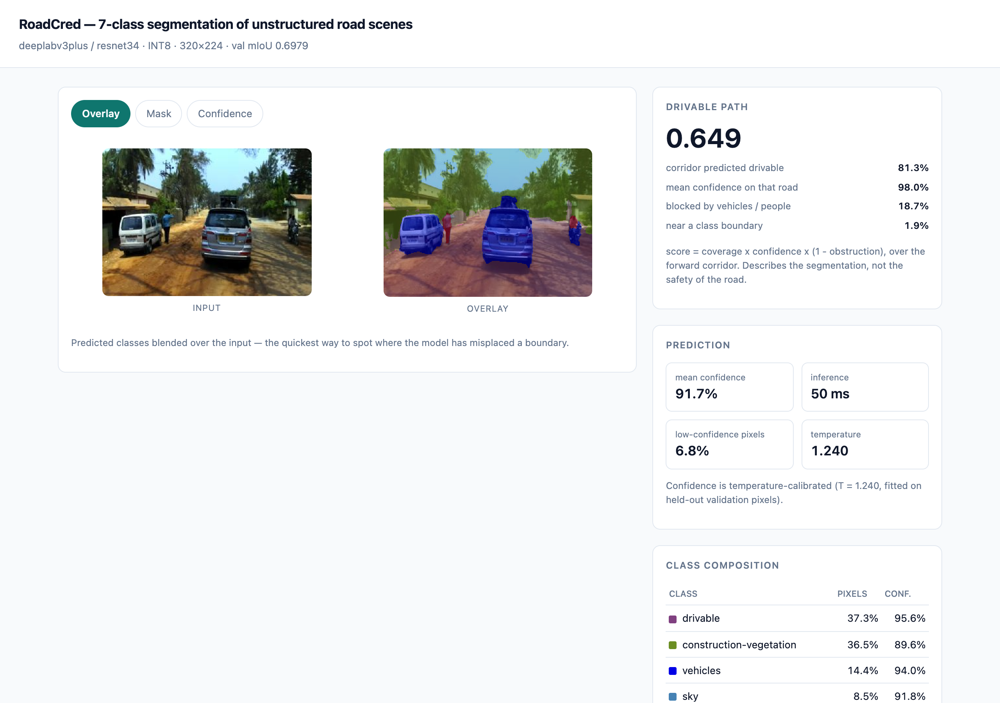
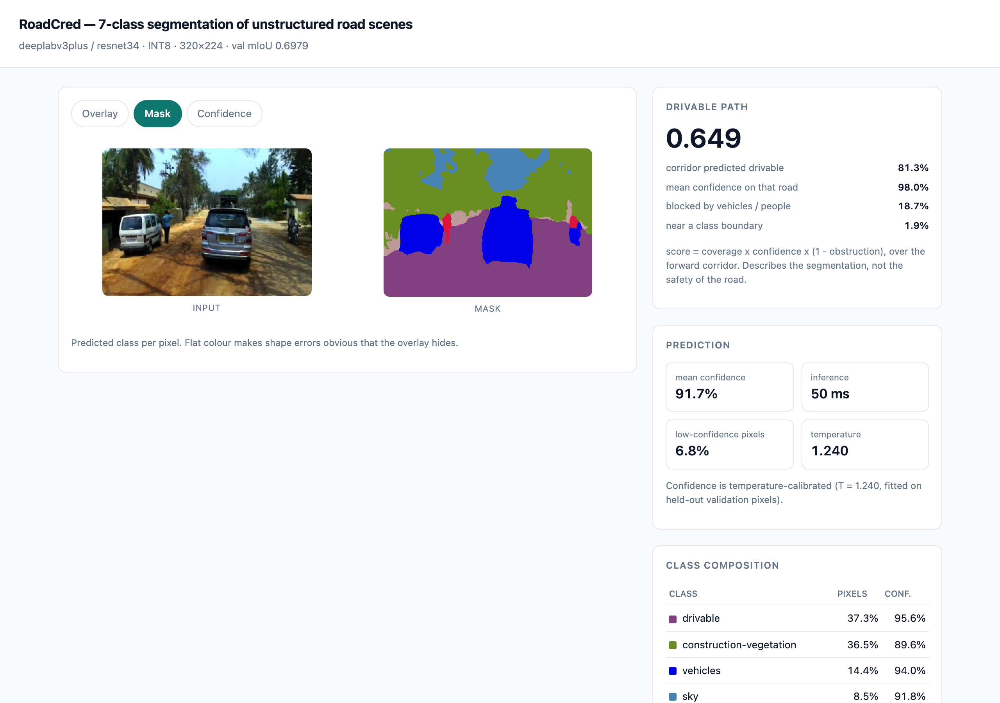
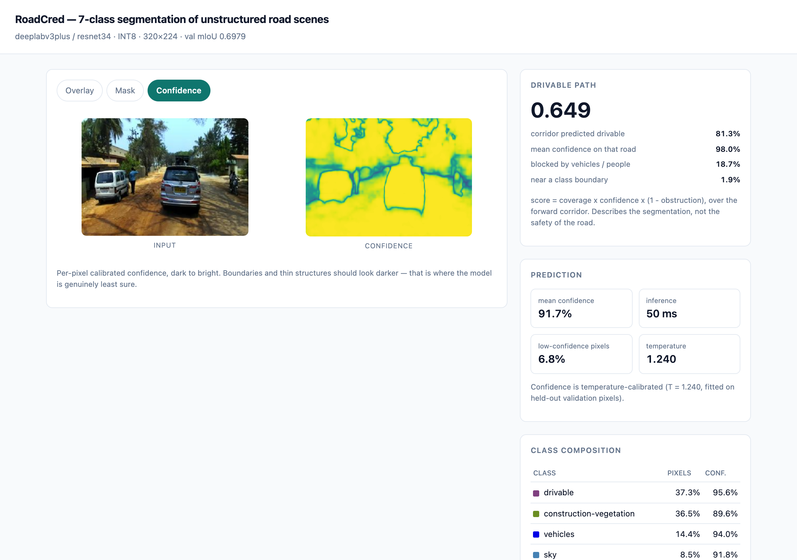

# RoadCred — Unstructured Road Scene Segmentation


**Left to right: what the camera sees, what the model says, and where the model is unsure.**

The first two panels are the task — 7 classes over an unstructured Indian road, where there
is no lane marking, the drivable surface is dirt, and the boundary between road and
not-road is a judgement call rather than a painted line. **The third panel is the
project.** It is the model's own calibrated
confidence, and it renders as an *edge map*: bright and certain across road, sky and
vegetation, dark along every boundary between them. The model is least sure exactly where
the classes meet — which turns out to explain its per-class accuracy far better than class
rarity does, and is the finding the rest of this README builds to.

---

7-class semantic segmentation of Indian road scenes on the India Driving Dataset, built as
a study in *evaluation rigour* rather than leaderboard chasing. A hand-written PyTorch
training loop drives every experiment; a controlled ablation varies one factor at a time;
and the headline result is a measurement of how badly a naive train/test split flatters a
model on this data. Ships with a calibrated FastAPI inference service and a
dependency-free demo page.

---

## Summary

> Built an end-to-end semantic segmentation system for unstructured Indian road scenes
> (7 classes, India Driving Dataset), written on a hand-rolled PyTorch training loop with
> AMP-free MPS support, warmup+cosine scheduling, early stopping and per-run experiment
> tracking. Quantified that a naive random frame split leaks 94.6% of validation frames
> into training via shared drive sequences, and reported drive-disjoint results throughout.
> Ran controlled ablations over five segmentation losses and four decoder architectures,
> measured confidence calibration with leakage-free temperature scaling, evaluated
> robustness across ten implemented test-time corruptions (five evaluated) with
> label-free BatchNorm adaptation, and
> shipped the model as an INT8-quantized ONNX service behind FastAPI, which reduces each
> frame to a bounded drivable-path score that reports its own known failure mode.
> 123 unit tests in CI, including an assertion that the generalization split cannot leak.

---

## The decision log

This is the order the project was actually reasoned through. Numbers are in
[`results/RESULTS.md`](results/RESULTS.md).

### 1. Pick a task the data can actually support

The dataset is **IDD Lite** — 1607 labelled frames across 370 drive sequences at 320×227.
An earlier draft of this project planned a road-damage class built by compositing an
external pothole dataset onto IDD's drivable regions. That was dropped, for a reason worth
stating: the labels would have been synthetic, and a reviewer would have been right to
discount every number derived from them.

IDD Lite already ships a real 7-class problem — IDD's own level-1 hierarchy — with genuine
imbalance:

| class | share of training pixels |
|---|---|
| drivable | 32.4% |
| construction-vegetation | 26.0% |
| sky | 18.9% |
| barrier-structures | 11.2% |
| vehicles | 8.1% |
| **non-drivable** | **2.2%** |
| **living-thing** | **1.3%** |

That imbalance is what makes the loss ablation an experiment rather than a formality.
**Every dataset in this project comes from IDD. There are no external data sources and no
synthetic labels.**

### 2. Get the label mapping right before anything else

IDD encodes labels at five parallel granularities (`id`, `level1Id` … `level4Id`), and the
same integer means different classes at different levels. Every mapping here is therefore
derived from IDD's official label table **keyed by class name**, never by hardcoded IDs.

This caught a real bug. IDD Lite ships bare `<frame>_label.png` files that contain *level-1*
IDs, but nothing in the filename says so. Filename-based level detection defaulted them to
level-3, which silently mapped `level1Id 1` — sidewalk, rail track, non-drivable fallback —
onto **drivable**. That is precisely the boundary this project measures. `remap_mask` now
range-checks every mask against its assumed level and raises rather than mis-mapping.

### 3. Make the evaluation honest before optimising the number

IDD groups frames into drive sequences. Frames within a drive are seconds apart on the same
road in the same light. Split those at random and validation frames have near-duplicates in
training.

Measured, not assumed: a random frame split puts **94.6% of validation frames in a drive
that also appears in training**. `tests/test_sequence_split.py` asserts that the honest
splits cannot leak, so the claim is enforced by CI rather than merely documented.

All three splits are built and trained, **three seeds per arm**, so the inflation is a
distribution rather than a point estimate:

| split | seeds | mIoU | std |
|---|---|---|---|
| drive-disjoint | 3 | 0.6768 | 0.0032 |
| random frame — **leaky control** | 3 | 0.6894 | 0.0009 |

**Inflation +0.0126 mIoU, at 3.9× the worst-arm seed spread.** The effect clears its own
noise floor, which a single-seed measurement could never have shown.

**The magnitude is smaller than I expected, and the reason is the interesting part.** 94.6%
contamination moved mIoU by only ~1.3 points because frames within an IDD drive sit a
median of ~4,400 frame indices apart — they share scene and lighting without being
near-duplicates. *Contaminated is not the same as duplicated.* The same fact independently
killed the temporal-consistency metric (§6). A dataset of genuinely consecutive frames
would be expected to show a far larger gap; this one does not, and the honest thing is to
report the modest number rather than the dramatic one I went looking for.

**A second finding fell out of running it properly.** The leaky arm is *more stable* across
seeds (std 0.0009) than the honest one (std 0.0032). Contamination does not only inflate
the mean — it suppresses the variance, because validation frames with near-relatives in
training depend less on which drives happened to land where. A leaky benchmark therefore
looks more reliable while telling you less, which is a nastier property than the inflation
itself.

The leaky arm is kept deliberately — as the control to argue against, never as a headline.

### 4. Write the training loop by hand

Every experiment runs through one loop (`modeling/train.py`) with warmup + cosine schedule,
gradient clipping, early stopping on validation mIoU, checkpointing, TensorBoard scalars,
and a CSV row per run capturing config, seed and git SHA. Losses are `nn.Module` subclasses
written from scratch and verified against hand computation.

Because every arm shares that recipe, a difference between two rows is attributable to the
factor that was varied.

A small engineering finding: dataloader workers are **off** by default. Augmented loading
measures ~640 img/s single-process against ~37 img/s of MPS training throughput, so worker
processes bought nothing and added spawn overhead and failure modes.

### 5. Report what the model doesn't know

The serving layer returns a confidence score, so that number has to mean something.
Temperature scaling is fitted on one half of the validation pixels and **every reported
figure computed on the other half** — fitting and reporting on the same pixels is the usual
way calibration results get overstated. The implementation recovers a known temperature of
3.0 as 2.973 in test.

### 6. Measure robustness without inventing a dataset

No adverse-weather dataset is used. Ten corruptions (fog, rain, low light, motion blur,
noise, JPEG …) are implemented and applied **at test time only** — the training augmentation pipeline
deliberately excludes them — so the degradation measures genuine distribution shift rather
than a train/test augmentation mismatch. Each corrupted set is re-evaluated after
**test-time BatchNorm adaptation**, which re-estimates running statistics on the shifted
data with no labels and no gradient steps. Five of the ten (fog, rain, low light, motion
blur, Gaussian noise) were evaluated at severities 1 and 3 in the run reported here; the
remaining five and severities 2/4/5 are implemented and driven by the same command.

**One idea was cut after checking the data.** Frame-to-frame temporal flicker would be the
natural stability metric, but IDD Lite's frames are not temporally adjacent — the median gap
between consecutive frames of a drive is ~4,400 frame indices, and only 0.5% are within 30
frames. A flicker number computed from them would have measured scene change. It was
replaced with perturbation stability, which measures the same property honestly.

### 7. Ship the artefact that was benchmarked

The model is exported to ONNX and quantized to INT8 with static, calibrated PTQ. Export is
verified against PyTorch on real frames, reporting both logit error **and the fraction of
pixels whose predicted class changes** — a graph can round-trip logits closely while still
flipping labels at boundaries. FP32 and INT8 are benchmarked on **CPU** with pinned threads,
because Apple silicon has no INT8 path through MPS and a GPU comparison would silently run
the quantized model in FP32.

The API serves the ONNX model, so the thing being demoed is the thing that was measured.

### 8. Reduce it to the number someone will actually ask for — and bound that number

A per-pixel class map is not what a consumer of this model wants. The question underneath
is always some version of *can the vehicle go forward*, and if the project declines to
answer it, a reader answers it anyway by eyeballing the overlay — less accurately, and with
no caveats attached. So the serving layer computes one explicitly: a **drivable-path
score** over the forward corridor, a trapezoid ahead of the camera, wide near the vehicle
and narrowing with distance.

```
score = coverage × mean_confidence × (1 − obstruction)
```

**A product, not a weighted sum.** The three terms are not interchangeable, and an average
would call a corridor that is 100% road but blocked by a truck "mostly fine". Any one
component collapsing should collapse the score, and under a product it does.

**Every component is returned alongside the score**, because the aggregate is ambiguous in
exactly the way that matters: a corridor scoring low because the model is unsure and one
scoring low because a bus is parked in it are different situations that a single number
cannot separate.

**It reports its own known failure mode.** This project measured that 17–20% of true
`non-drivable` is absorbed into `drivable`, and that six independent interventions failed to
fix it — so this score is optimistic at precisely the boundary that matters most. When the
corridor spans a drivable/non-drivable border the response sets a `road_edge_caveat` flag
and the demo page renders the warning rather than burying it.

It is a **description of the segmentation, not an assessment of the road**, and calling it
"drivability" does not make it one. The out-of-scope restriction in
[`MODEL_CARD.md`](MODEL_CARD.md) is unchanged: not for vehicle control, driver assistance,
or navigation.

---

## Results

See **[`results/RESULTS.md`](results/RESULTS.md)** — generated from the CSVs in `results/`
by `scripts/build_results.py`, so no number in it is hand-transcribed.

Headline figures measured so far:

| result | value |
|---|---|
| Best validation mIoU | **0.6979** (DeepLabV3+/ResNet-34, encoder stride 8) |
| Random-split leakage, 3 seeds/arm | **+0.0126 mIoU** inflation, **3.9× the seed spread** |
| Held-out test set | val 0.5782 → test 0.5778: **selection optimism +0.0004** |
| Encoder stride 16 → 8 | **+0.0077 mIoU**, concentrated in boundary-heavy classes |
| Run-to-run noise, identical config *and seed* | **0.0012 mIoU** (MPS is nondeterministic) |
| INT8 quantization | **4.4× faster, 3.9× smaller, −0.0001 mIoU** (42.4 ms, 22.9 MB, CPU) |
| Distillation vs same student trained alone | **+0.0028 mIoU** at identical capacity |
| Calibration | overconfident at **T = 1.240**; ECE 0.0209 → **0.0043** (−79%) |
| Confidence under severe motion blur | ECE **0.0026 → 0.0646** — 25× worse, accuracy only 0.91 → 0.82 |
| Test-time BN adaptation, severe shot noise | 0.2688 → **0.5730** (+0.304, no labels, no gradients) |
| FGSM, ε = 4/255 | **71.7%** of clean mIoU |

### It is not rarity. It is geometry.

The obvious reading of the per-class table is that errors track class rarity. That reading
is a confound, and this project ended up disproving its own earlier claim.

What predicts a class's IoU is how much of it is *boundary*, not how rare it is. The
decisive case: `barrier-structures` is **8.5× more common** than `living-thing` and scores
about the same IoU. Rarity cannot explain that; thinness predicts it.

Correlation was only the hypothesis — n = 7 classes, with the two predictors themselves
collinear at r = −0.91. So it was tested directly. Halving the encoder's output stride
doubles the resolution of the features the decoder sees and changes nothing else:

| class | pixels near a border | Δ IoU at stride 8 |
|---|---|---|
| living-thing | 55% | **+0.018** |
| non-drivable | 40% | **−0.017** |
| barrier-structures | 35% | **+0.026** |
| vehicles | 22% | +0.014 |
| construction-vegetation | 19% | +0.010 |
| sky | 12% | +0.001 |
| drivable | 7% | +0.001 |

The two flattest classes gain +0.001; the boundary-heavy ones gain 10–26× that. **That is
a controlled intervention, not a correlation.**

And `non-drivable` goes the wrong way — as it did under region losses, boundary-weighted
loss, U-Net and FPN. **Six independent interventions improved `living-thing` and degraded
`non-drivable`**; only explicit class re-weighting ever helped it. That splits one apparent
failure mode into two: `living-thing` is a small compact object that wants resolution,
while `non-drivable` is a thin strip abutting `drivable` (32% of all pixels) that gets
absorbed by it — and every sharpening intervention makes the model *more* willing to call
an ambiguous road edge "road".

All results are at IDD Lite scale on a single M1 Pro. This is a small dataset and the
absolute mIoU values reflect that. The comparisons are controlled, so the *differences*
between rows carry the meaning.

---

## Quickstart

```bash
# 1. Data — see DOWNLOADS.md. Extract IDD Lite so this path exists:
#    data/raw/idd_seg/idd20k_lite/{leftImg8bit,gtFine}/

# 2. Environment
python3.11 -m venv .venv && .venv/bin/pip install -r requirements.txt

# 3. Build the dataset variants
PYTHONPATH=. .venv/bin/python -m data.prepare_masks --split-mode all

# 4. Train a model (~30 min on an M1 Pro)
PYTHONPATH=. .venv/bin/python -m modeling.train --data data/processed/level1_official

# 5. Or reproduce every table and figure (~7 h)
./scripts/reproduce.sh
```

### Serving and the demo

```bash
# Export + quantize, then serve
PYTHONPATH=. .venv/bin/python -m compression.quantize --checkpoint checkpoints/<best>.pt
PYTHONPATH=. .venv/bin/uvicorn serving.api:app --reload --port 8000
```

Open <http://localhost:8000>. Drop in a road-scene image and toggle the overlay / mask /
confidence layers.



The right-hand column is where the reasoning is. **Drivable path** (§8) scores the forward
corridor and shows the components that produced it — on this frame, 81.3% of the corridor
predicted drivable at 98.0% mean confidence, against 18.7% blocked by the two vehicles
ahead. That 18.7% is the whole reason the score sits at 0.649 rather than 0.80, and the
breakdown is what makes the difference readable. **Prediction** carries the calibrated mean
confidence and the temperature it was scaled by; **Class composition** gives per-class
pixel share and confidence.

The **mask** layer drops the photograph entirely and shows the raw class map:



Worth a look precisely because it is unflattering. With the photograph gone there is
nothing left to lend the output plausibility, and the shape errors stand on their own. The
vehicles hold clean silhouettes. But read the class table beside it: **`non-drivable` is
0.0% of this frame.** A dirt road with an unpaved shoulder on both sides, and the model
predicts not one pixel of it — the entire road edge has gone to `drivable` (purple) or
`barrier-structures` (dusty rose).

That is the absorption failure mode of §8, caught in the act. Not a degraded boundary: an
*absent class*. The overlay hides it because the underlying photograph supplies the edge
your eye expects; the flat mask has no such cover.

**The confidence view is the one worth looking at**, because it reproduces this project's
per-class finding on a single frame, with no analysis:



It renders as an **edge map**. Region interiors — road, sky, vegetation — are uniformly
bright; every class boundary is dark. The model is least certain exactly where classes
meet, which is the same effect the per-class table measures at r = −0.92 against boundary
share. Read the class panel alongside it and the ordering repeats: on this frame the flat
classes score 89–96% mean confidence while the thin ones fall to 40–68%.

That is the whole argument of *It is not rarity. It is geometry.* above, visible without
reading a number.

The demo is a **single dependency-free HTML file** served by the API itself — no npm, no
build step, no bundle that can drift out of sync with the endpoint it calls. It replaced a
React/Vite/TypeScript frontend whose two dashboard pages re-rendered the same CSVs that
[`results/RESULTS.md`](results/RESULTS.md) already generates, and generates better. The
one page that did something the report could not — run the model — needed no framework.

### Tests

```bash
PYTHONPATH=. .venv/bin/python -m pytest tests/ -v      # 123 tests, no dataset required
```

Tests needing the real IDD tree skip themselves, so CI runs green without a download.

---

## Repository layout

```
data/         label mapping (name-keyed), frame discovery, split strategies, dataset build
modeling/     hand-written training loop, losses, dataset, model factory, run tracking
evaluation/   metrics, boundary IoU, calibration, corruptions, stability, error analysis
compression/  ONNX export with parity check, INT8 PTQ, latency benchmarking
serving/      FastAPI service (ONNX Runtime inference), drivable-path scoring
serving/static/index.html   the demo page, dependency-free
docs/images/  demo screenshots, regenerated by scripts/capture_demo.py
scripts/      ablation drivers, reproduction, RESULTS.md generator
tests/        123 tests incl. the anti-leakage assertion
```

## Limitations

- **Scale.** 1607 labelled frames at 320×227. Absolute mIoU is not comparable to results on
  full IDD 20K or Cityscapes, and is not claimed to be.
- **Corruptions are synthetic.** The fog model is depth-independent because IDD Lite ships
  no depth map; real adverse-weather data would be a stronger test.
- **No held-out test set.** IDD Lite ships test *images* but withholds their labels, so
  validation does double duty: it is both the early-stopping criterion and the set every
  number is reported on. Model selection has therefore seen the reporting set. The
  calibration split (§5) is clean *within* validation — temperature is fitted and evaluated
  on disjoint pixel halves — but it inherits this. Every figure here should be read as a
  validation number, not a test number.
- **Seed variance is measured for the headline, assumed elsewhere.** The split experiment
  was run across three seeds per arm: drive-disjoint 0.6768 ± 0.0032, random-frame
  0.6894 ± 0.0009, giving **+0.0126 mIoU at 3.9× the worst-arm spread** — so the leakage
  effect clears its own noise floor. Every *other* ablation cell is still one seed, and
  differences there smaller than ~0.003 should be read as unresolved. Separately, two runs
  with identical config **and identical seed** differ by 0.0012 mIoU: MPS offers no
  determinism guarantee and `cudnn.deterministic` is CUDA-only.
- **The leaky split is also the more stable one** (std 0.0009 vs 0.0032). Contamination
  does not only inflate the mean, it suppresses the variance — which is precisely why a
  leaky benchmark feels more reliable while telling you less.
- **Two of three recorded runs have `git_dirty=True`.** The run log stores a commit SHA per
  row, but where the tree was dirty that SHA does not fully identify the code that ran.
- **`train_seconds` is wall-clock, not compute.** Runs left going overnight include machine
  sleep, so that column is not a benchmark. Latency figures in the compression tables are
  measured properly, under pinned threads.
- **Architecture comparison is decoder-only.** All arms share an encoder family and the same
  training recipe, so it does not speak to architectures with different training needs.
