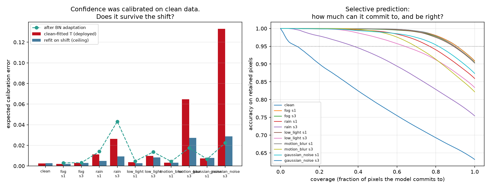
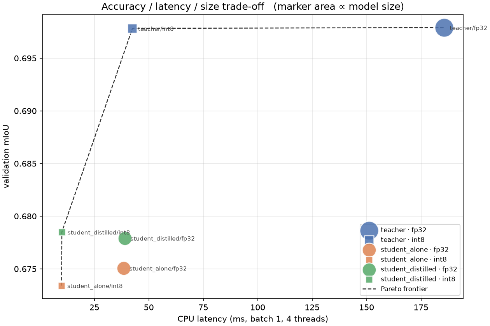

# Results

*Generated by `scripts/build_results.py` from the CSVs in `results/`. Do not edit by hand.*

**Task.** 7-class semantic segmentation of unstructured Indian road scenes, using IDD's
own level-1 label hierarchy: `drivable`, `non-drivable`, `living-thing`, `vehicles`,
`barrier-structures`, `construction-vegetation`, `sky`.

**Data.** IDD Lite (`idd20k_lite`) — 1607 labelled frames across 370 drive sequences,
at 320×227, trained at 320×224. Every dataset in this project comes from IDD; there are
no external data sources and no synthetic labels.

**Scale, stated plainly.** All results are at IDD Lite scale on a single M1 Pro (MPS).
This is a small dataset and the absolute mIoU values reflect that. The comparisons are
controlled — one factor varies at a time, with everything else held fixed — so the
*differences* between rows are meaningful even where the absolute numbers are modest.

Runs recorded: 23. Code version: `813d291`.

---
## 1. Does a random split overstate generalization?

IDD groups frames into drive sequences — one folder per drive. Frames from the same
drive were captured on the same road in the same conditions, so they are correlated.
Splitting frames at random puts related frames on both sides of the train/val
boundary.

Measured on this dataset, a random frame split puts **94.6% of validation frames in a
drive that also appears in training** (1607 frames across 370 drives). Each row below
trains the identical model, schedule, augmentation and seed; only the split differs.

| split | mIoU | mean acc | pixel acc | best epoch |
|---|---|---|---|---|
| IDD's own split (drive-disjoint) | 0.6913 | 0.7889 | 0.8867 | 27 |
| Held-out drive sequences | 0.6755 | 0.7690 | 0.8866 | 27 |
| Random frame split — **leaky control** | 0.6894 | 0.7817 | 0.8954 | 30 |

**Measured inflation: +0.0139 mIoU (+2.1%).** The random split reports
0.6894 where a drive-disjoint split of the same pooled frames reports
0.6755.

Only `sequence` and `frame` are compared. Both are re-splits of the same 1607
pooled frames at ~15% validation, so the split rule is the only thing that differs.
`official` is IDD's own split with a different validation set (204 frames against
~241), so including it would confound leakage with a change of evaluation set; it
is listed for reference only.

**The inflation is real but smaller than the contamination rate suggests.** 94.6% of
validation frames sharing a drive with training moved mIoU by only ~0.014. The
reason shows up elsewhere in this project: frames within an IDD drive sit a median
of ~4,400 frame indices apart, so they share scene and lighting without being
near-duplicates. *Contaminated is not the same as duplicated* — which is precisely
why this had to be measured rather than assumed. A dataset whose frames really were
consecutive would be expected to show a far larger gap.

For reference, IDD's own split scores 0.6913 on its own
204-frame validation set.

---

## 1b. Is that difference bigger than seed noise?

Section 1 reports a difference between two splits from one seed each, which
cannot on its own be distinguished from run-to-run variance. Both arms are
retrained across seeds here; everything but the seed and the split rule is fixed.

| split | seeds | mean mIoU | std | min | max |
|---|---|---|---|---|---|
| sequence | 3 | 0.6768 | 0.0032 | 0.6734 | 0.6799 |
| frame | 3 | 0.6894 | 0.0009 | 0.6887 | 0.6904 |

Mean inflation from the leaky split: **+0.0126 mIoU**, against a worst-arm seed standard deviation of 0.0032. The effect is larger than the seed spread, so the direction survives the noise.

Reported either way. A difference that does not clear its own noise floor is a result about the experiment's resolution, not a null result about leakage.

---

## 2. Loss ablation

IDD Lite is genuinely imbalanced — `living-thing` is 1.31% of training pixels and
`non-drivable` 2.19%, against `construction-vegetation` at 26%. Plain cross-entropy
optimises a pixel-weighted objective and can afford to neglect the rare classes, so
the region and boundary losses have something real to fix.

Held fixed across all arms: architecture, encoder, schedule, augmentation, split, seed.

| loss | mIoU | mean acc | pixel acc | best epoch | train s |
|---|---|---|---|---|---|
| ce | 0.6903 | 0.7869 | 0.8863 | 24 | 1,870 |
| weighted_ce | 0.6921 | 0.8268 | 0.8827 | 30 | 1,872 |
| dice | 0.6962 | 0.8001 | 0.8853 | 29 | 1,998 |
| tversky | 0.6938 | 0.8070 | 0.8844 | 30 | 2,003 |
| boundary | 0.6913 | 0.7936 | 0.8862 | 24 | 1,849 |

Per-class IoU — this is where the losses actually differ:

| loss | barrier-structures | construction-vegetation | drivable | living-thing | non-drivable | sky | vehicles |
|---|---|---|---|---|---|---|---|
| ce | 0.481 | 0.758 | 0.936 | 0.489 | 0.459 | 0.943 | 0.766 |
| weighted_ce | 0.494 | 0.752 | 0.935 | 0.500 | 0.465 | 0.942 | 0.756 |
| dice | 0.489 | 0.753 | 0.935 | 0.534 | 0.457 | 0.941 | 0.763 |
| tversky | 0.484 | 0.755 | 0.936 | 0.532 | 0.450 | 0.942 | 0.758 |
| boundary | 0.487 | 0.758 | 0.937 | 0.504 | 0.448 | 0.944 | 0.762 |

**Winner: `dice` at 0.6962 mIoU (+0.0058 against cross-entropy).**

One methodological note worth stating: in *multiclass single-label* segmentation,
Tversky's asymmetry is much weaker than in the binary case, because every false
negative for one class is simultaneously a false positive for another, so the
`alpha`/`beta` effects partly cancel. This was verified against hand-computed values
in `tests/test_losses.py`.

---

## 3. Architecture comparison

Same encoder family, loss, schedule and split; only the decoder differs. Parameter
count and training time are reported alongside accuracy because a portfolio number
that ignores cost is not a decision.

| model | decoder | encoder | mIoU | params | train s |
|---|---|---|---|---|---|
| deeplabv3plus_resnet34_s0 | deeplabv3plus | resnet34 | 0.6892 | 22,438,999 | 1,837 |
| unet_resnet34_s0 | unet | resnet34 | 0.6976 | 24,437,239 | 1,831 |
| fpn_resnet34_s0 | fpn | resnet34 | 0.6931 | 23,156,167 | 1,711 |
| deeplabv3plus_mobilenet_v2_s0 | deeplabv3plus | mobilenet_v2 | 0.6752 | 4,380,055 | 960.8000 |

---

## 3b. Stride, not scarcity

Section 9 finds per-class IoU tracks a class's *boundary share* far better than
its rarity — pointing at thin structures lost to downsampling rather than at
class imbalance. This halves the encoder's output stride, doubling the resolution
of the features the decoder sees and changing nothing else.

Overall mIoU 0.6902 → **0.6979** (+0.0077).

| class | boundary share | IoU @ stride 16 | IoU @ stride 8 | Δ |
|---|---|---|---|---|
| living-thing | 54.5% | 0.5033 | 0.5217 | +0.0184 |
| non-drivable | 39.8% | 0.4575 | 0.4401 | -0.0174 |
| barrier-structures | 35.5% | 0.4775 | 0.5032 | +0.0257 |
| vehicles | 22.2% | 0.7598 | 0.7741 | +0.0143 |
| construction-vegetation | 19.3% | 0.7558 | 0.7662 | +0.0104 |
| sky | 11.8% | 0.9430 | 0.9440 | +0.0010 |
| drivable | 6.6% | 0.9346 | 0.9361 | +0.0015 |

Rows are ordered by boundary share — thinnest first. If the diagnosis holds, the
gains concentrate at the top of this table. If they are spread evenly, the
limitation is the source resolution rather than the network, and no amount of
architectural change recovers it at 320×227.

---

## 5. Confidence calibration

The serving layer returns a confidence score, so that score has to mean something.
Temperature is fitted on one half of the validation pixels and every number below is
computed on the other half, which the fit never saw.

| metric | before | after |
|---|---|---|
| Expected calibration error | 0.0209 | 0.0043 |
| Maximum calibration error | 0.0668 | 0.0235 |

Fitted temperature **T = 1.240** (overconfident before correction), reducing ECE by 79.3%.

Temperature scaling is monotone, so mIoU is provably unchanged — only the confidence
distribution moves.


---

## 5b. A genuinely held-out test set

Everywhere else in this report, validation does double duty: it is the
early-stopping criterion *and* the set the number is reported on, so model
selection has seen it. IDD withholds its own test labels, so a third partition is
carved from the labelled frames instead — drive-disjoint from **both** train and
validation, since a test set sharing drives with validation is contaminated
through model selection just as surely as through training.

| split | frames | mIoU | boundary mIoU | pixel acc |
|---|---|---|---|---|
| val (used for early stopping) | 241 | 0.5782 | 0.2105 | 0.8557 |
| **test (never seen)** | 242 | **0.5778** | 0.2055 | 0.8456 |

Selection optimism: **+0.0004 mIoU**. That gap is what early stopping bought itself on the validation set, and it is the correction that should be mentally applied to every other number in this report.

Boundary mIoU trails region mIoU by 0.3723 — the model places regions better than it places their edges.

---

## 6. Robustness under adverse conditions

10 corruptions (`brightness`, `contrast`, `fog`, `gaussian_blur`, `gaussian_noise`, `jpeg`, `low_light`, `motion_blur`, `rain`, `shot_noise`) at severities 1/3, standing in for adverse driving conditions.
None of them appear in the training augmentation pipeline, so the drop measures
genuine distribution shift rather than a train/test augmentation mismatch.

Each corrupted set is also evaluated after **test-time BatchNorm adaptation** — the
running statistics are re-estimated on the shifted data using no labels and no
gradient steps. It isolates how much of the degradation is merely feature-statistic
drift rather than a genuine failure to perceive.

| corruption | sev | mIoU | + BN adapt | recovered | retention |
|---|---|---|---|---|---|
| brightness | 1 | 0.6979 | 0.6971 | -0.0008 | 1.0000 |
| brightness | 3 | 0.6937 | 0.6941 | 0.0004 | 0.9940 |
| contrast | 1 | 0.6963 | 0.6971 | 0.0008 | 0.9977 |
| contrast | 3 | 0.6874 | 0.6968 | 0.0094 | 0.9849 |
| fog | 1 | 0.6973 | 0.6975 | 0.0002 | 0.9992 |
| fog | 3 | 0.6898 | 0.6977 | 0.0079 | 0.9884 |
| gaussian_blur | 1 | 0.6948 | 0.6949 | 0.0000 | 0.9956 |
| gaussian_blur | 3 | 0.6398 | 0.6595 | 0.0197 | 0.9167 |
| gaussian_noise | 1 | 0.6520 | 0.6749 | 0.0229 | 0.9342 |
| gaussian_noise | 3 | 0.3901 | 0.6233 | 0.2332 | 0.5589 |
| jpeg | 1 | 0.6839 | 0.6813 | -0.0026 | 0.9800 |
| jpeg | 3 | 0.6643 | 0.6642 | -0.0001 | 0.9519 |
| low_light | 1 | 0.6910 | 0.6896 | -0.0014 | 0.9901 |
| low_light | 3 | 0.5923 | 0.6543 | 0.0621 | 0.8486 |
| motion_blur | 1 | 0.6885 | 0.6938 | 0.0052 | 0.9865 |
| motion_blur | 3 | 0.5538 | 0.6467 | 0.0929 | 0.7935 |
| rain | 1 | 0.6387 | 0.6475 | 0.0088 | 0.9152 |
| rain | 3 | 0.5036 | 0.5681 | 0.0644 | 0.7216 |
| shot_noise | 1 | 0.4517 | 0.6493 | 0.1977 | 0.6472 |
| shot_noise | 3 | 0.2688 | 0.5730 | 0.3042 | 0.3851 |

Clean baseline: **0.6979 mIoU**. Worst case: `shot_noise` at severity 3 → 0.2688.
 BatchNorm adaptation recovers **+0.0512 mIoU on average**, without labels or gradient updates.


---

## 6b. Is the confidence score still a probability in the rain?

Section 5 calibrates on clean validation data and the serving layer applies that
temperature to everything it sees. But a deployed model cannot refit against
conditions it has not encountered, so the question is whether the *clean-fitted*
temperature still holds under shift. Reported alongside is the temperature refit
on each corruption — unreachable in deployment, and included as the ceiling.

| condition | accuracy | mean confidence | over-confidence | ECE (deployed T) | ECE (refit) |
|---|---|---|---|---|---|
| clean | 0.9089 | 0.9104 | 0.0015 | 0.0026 | 0.0027 |
| fog s1.0 | 0.9082 | 0.9097 | 0.0015 | **0.0021** | 0.0021 |
| fog s3.0 | 0.9042 | 0.9059 | 0.0017 | **0.0029** | 0.0029 |
| rain s1.0 | 0.8594 | 0.8481 | -0.0113 | **0.0113** | 0.0049 |
| rain s3.0 | 0.7543 | 0.7806 | 0.0263 | **0.0263** | 0.0094 |
| low_light s1.0 | 0.9027 | 0.9062 | 0.0035 | **0.0037** | 0.0028 |
| low_light s3.0 | 0.8341 | 0.8420 | 0.0080 | **0.0099** | 0.0083 |
| motion_blur s1.0 | 0.9035 | 0.9062 | 0.0026 | **0.0032** | 0.0033 |
| motion_blur s3.0 | 0.8218 | 0.8865 | 0.0646 | **0.0646** | 0.0273 |
| gaussian_noise s1.0 | 0.8735 | 0.8755 | 0.0020 | **0.0074** | 0.0078 |
| gaussian_noise s3.0 | 0.6317 | 0.7647 | 0.1330 | **0.1330** | 0.0287 |

Worst case: `gaussian_noise` at severity 3.0, where calibration error is **51.5× the clean figure**. The model does not merely become less accurate under shift — it becomes less accurate *while remaining confident*, which is the failure mode a confidence score exists to prevent.

The gap between the two ECE columns is the part attributable purely to the
temperature being fitted on the wrong distribution, and is therefore the part a
shift-aware calibration scheme could in principle recover.

### Does BatchNorm adaptation restore confidence, or only accuracy?

Section 6 shows label-free BN adaptation recovering much of the lost mIoU.
Whether it also repairs the confidence distribution is a separate question:
an accurate model that still misstates its certainty is not obviously safer.

| condition | ECE before | ECE after BN | accuracy before | accuracy after |
|---|---|---|---|---|
| fog s1.0 | 0.0021 | 0.0030 | 0.9082 | 0.9078 |
| fog s3.0 | 0.0029 | 0.0032 | 0.9042 | 0.9078 |
| rain s1.0 | 0.0113 | 0.0140 | 0.8594 | 0.8799 |
| rain s3.0 | 0.0263 | 0.0432 | 0.7543 | 0.8393 |
| low_light s1.0 | 0.0037 | 0.0047 | 0.9027 | 0.9062 |
| low_light s3.0 | 0.0099 | 0.0136 | 0.8341 | 0.8893 |
| motion_blur s1.0 | 0.0032 | 0.0044 | 0.9035 | 0.9051 |
| motion_blur s3.0 | 0.0646 | 0.0176 | 0.8218 | 0.8823 |
| gaussian_noise s1.0 | 0.0074 | 0.0067 | 0.8735 | 0.9011 |
| gaussian_noise s3.0 | 0.1330 | 0.0223 | 0.6317 | 0.8663 |

### Selective prediction

If the confidence number carries information, abstaining on the least confident
pixels should raise accuracy on the rest. This is the operating-point question a
perception stack actually asks, and it replaces the hardcoded 0.6 threshold in the
serving layer with a measured value.

| condition | coverage at 95% accuracy | risk-coverage AUC |
|---|---|---|
| clean | 0.909 | 0.9879 |
| fog s1.0 | 0.908 | 0.9877 |
| fog s3.0 | 0.897 | 0.9863 |
| rain s1.0 | 0.767 | 0.9715 |
| rain s3.0 | 0.377 | 0.9065 |
| low_light s1.0 | 0.891 | 0.9863 |
| low_light s3.0 | 0.640 | 0.9563 |
| motion_blur s1.0 | 0.897 | 0.9872 |
| motion_blur s3.0 | 0.695 | 0.9610 |
| gaussian_noise s1.0 | 0.813 | 0.9756 |
| gaussian_noise s3.0 | 0.084 | 0.7964 |



---

## 7. Prediction stability

A deployed segmenter sees near-identical scenes repeatedly; one that flips classes
under imperceptible input changes is unusable at any mIoU. The natural measurement is
frame-to-frame flicker on video — **which IDD Lite cannot support**: frames within a
drive are not adjacent (median gap ~4,400 frame indices, only 0.5% within 30 frames),
so a flicker number computed from them would really be measuring scene change.

Instead, each image is perturbed by a small label-preserving transform and the
prediction compared against the unperturbed one. Geometric shifts are inverted before
comparison, so only genuine class flips are counted. No ground truth is required.

| perturbation | flip rate | flip rate (conf ≥ 0.8) | Δ confidence |
|---|---|---|---|
| shift_1px | 0.0189 | 0.0001 | 0.0152 |
| shift_2px | 0.0307 | 0.0010 | 0.0234 |
| brightness_5pct | 0.0038 | 0.0000 | 0.0034 |
| brightness_-5pct | 0.0035 | 0 | 0.0031 |
| noise_sigma0.01 | 0.0135 | 0.0004 | 0.0108 |
| jpeg_q90 | 0.0072 | 0.0000 | 0.0060 |

---

## 8. Compression and deployment

Exported to ONNX and quantized to INT8 with static, calibrated post-training
quantization. Both precisions are benchmarked through ONNX Runtime **on CPU with a
pinned thread count**: Apple silicon has no INT8 path through MPS, so a GPU
comparison would silently run the quantized model in FP32 and report a meaningless
speedup.

| precision | mIoU | latency ms | p95 ms | size MB | img/s |
|---|---|---|---|---|---|
| fp32 | 0.70 | 185.58 | 186.53 | 90.00 | 5.39 |
| int8 | 0.70 | 42.38 | 42.46 | 22.89 | 23.59 |

INT8 costs **-0.0001 mIoU** for a **4.38× speedup** and **3.93× smaller** model.

The export is verified against PyTorch on real validation frames before it is used:
`compression/export.py` reports mean logit error *and* the fraction of pixels whose
predicted class changes, because a graph can round-trip logits closely while still
flipping labels at boundaries.

---

## 8b. Knowledge distillation

The comparison that matters is not whether a distilled student beats its teacher —
it will not — but whether it beats **the same student trained alone**, at identical
capacity, data, schedule and seed. Only that isolates the value of the teacher's soft
targets from the value of simply having a smaller model.

| variant | encoder | mIoU | params | vs student alone | vs teacher |
|---|---|---|---|---|---|
| teacher | checkpoints/arch_unet_resnet34_s0.pt | 0.6976 | 24,437,239 | — | — |
| student_alone | resnet18 | 0.6751 | 12,330,839 | — | — |
| student_distilled | resnet18 | 0.6779 | 12,330,839 | 0.0028 | -0.0197 |

**Distillation helped: +0.0028 mIoU against the identical student trained alone.**

---

## 8c. Deployment Pareto

Every variant at both precisions, benchmarked identically. A configuration is
*dominated* when another is at least as fast and at least as accurate; only the
survivors represent a real deployment choice.

| variant | precision | mIoU | latency ms | p95 ms | size MB | Pareto-optimal |
|---|---|---|---|---|---|---|
| teacher | fp32 | 0.70 | 185.62 | 186.40 | 90.00 | yes |
| teacher | int8 | 0.70 | 42.48 | 42.53 | 22.89 | yes |
| student_alone | fp32 | 0.68 | 38.52 | 39.10 | 49.49 |  |
| student_alone | int8 | 0.67 | 9.95 | 10.14 | 12.64 | yes |
| student_distilled | fp32 | 0.68 | 38.97 | 39.11 | 49.49 |  |
| student_distilled | int8 | 0.68 | 10.07 | 10.49 | 12.64 | yes |



---

## 9. Error analysis

Validation mIoU 0.6979. Per-image mIoU percentiles: p5=0.518, p25=0.590, p50=0.635, p75=0.693, p95=0.740

Strongest confusions (share of a true class's pixels given to another):

| true class | predicted as | rate |
|---|---|---|
| barrier-structures | construction-vegetation | 24.6% |
| non-drivable | drivable | 19.5% |
| living-thing | vehicles | 18.8% |
| non-drivable | barrier-structures | 15.3% |
| living-thing | barrier-structures | 10.1% |
| construction-vegetation | barrier-structures | 7.4% |

### Is it rarity, or is it thinness?

The obvious reading of the per-class spread is that IoU tracks class rarity.
That reading is confounded. Below, classes are ordered by how much of each one
lies within 2px of a class border — computed from the training masks alone, with
no model involved.

| class | share of pixels | pixels near a border | IoU |
|---|---|---|---|
| drivable | 32.4% | 6.6% | 0.9361 |
| sky | 18.9% | 11.8% | 0.9440 |
| construction-vegetation | 26.0% | 19.3% | 0.7662 |
| vehicles | 8.1% | 22.2% | 0.7741 |
| barrier-structures | 11.2% | 35.5% | 0.5032 |
| non-drivable | 2.2% | 39.8% | 0.4401 |
| living-thing | 1.3% | 54.5% | 0.5217 |

Across the 7 classes, IoU correlates at **r = -0.91** (r² = 0.82) with boundary share, against **r = +0.78** (r² = 0.62) with log frequency. Geometry explains the spread better than rarity does, and there is a decisive single case: `barrier-structures` is 8.5× more common than `living-thing` and scores the same IoU, which a rarity story cannot account for.

**Stated with its limits.** The two predictors are themselves correlated at r = -0.91 — rare classes here *are* the thin ones — and 7 points cannot separate them. This is a hypothesis with a counterexample, not a settled result. The experiment that would settle it is one arm at `encoder_output_stride=8`, everything else fixed: if geometry is binding, the thin classes gain disproportionately.


The hardest validation frames, shown as image / ground truth / prediction / error map:


---

## Reproducing

```bash
python -m data.prepare_masks --split-mode all   # build dataset variants
./scripts/reproduce.sh                          # every table above
```
