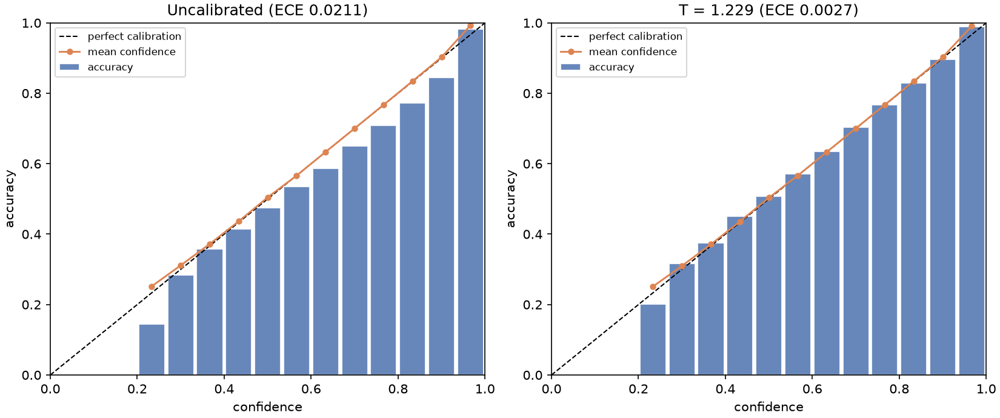
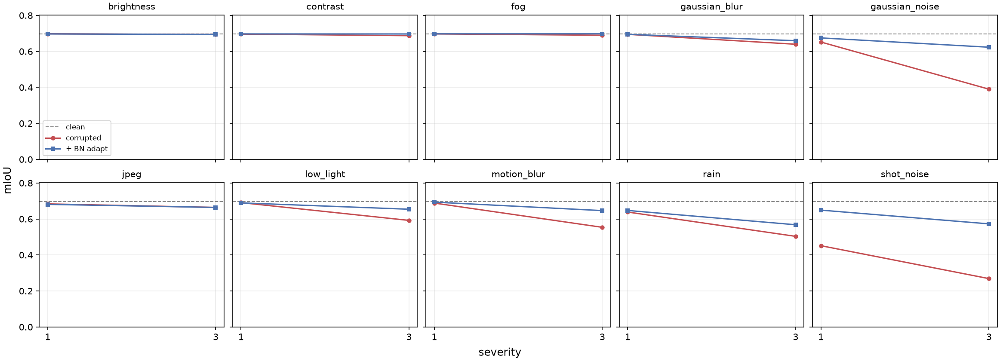
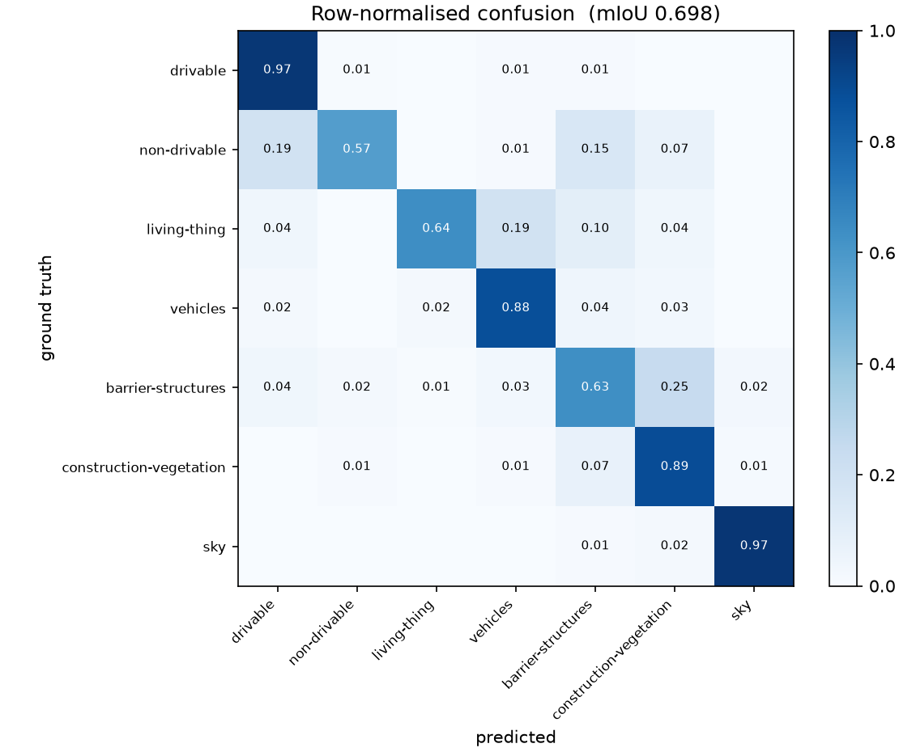
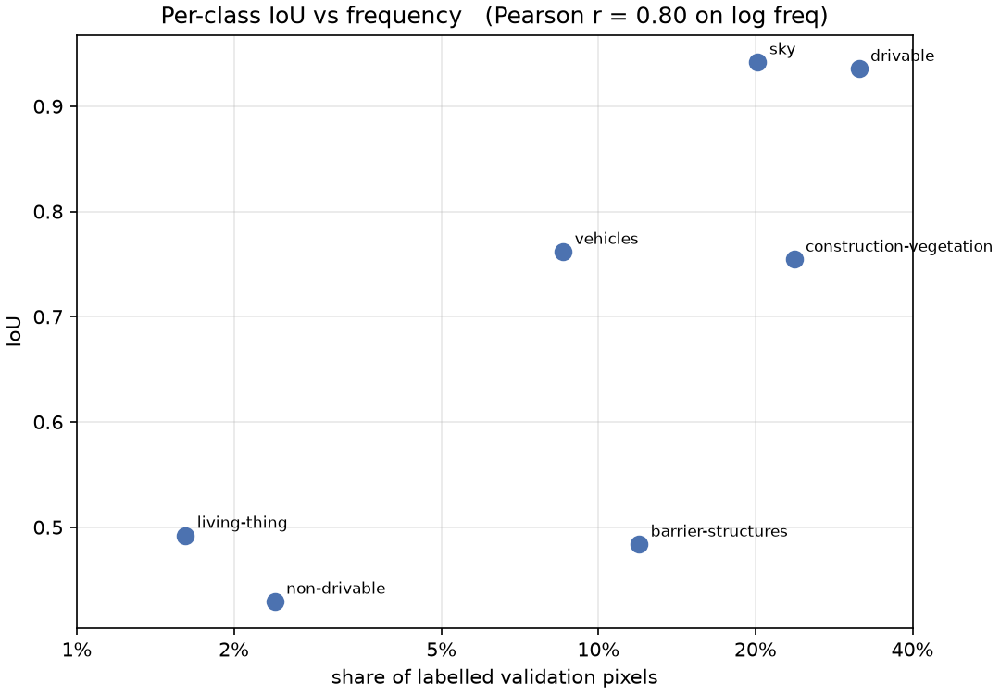
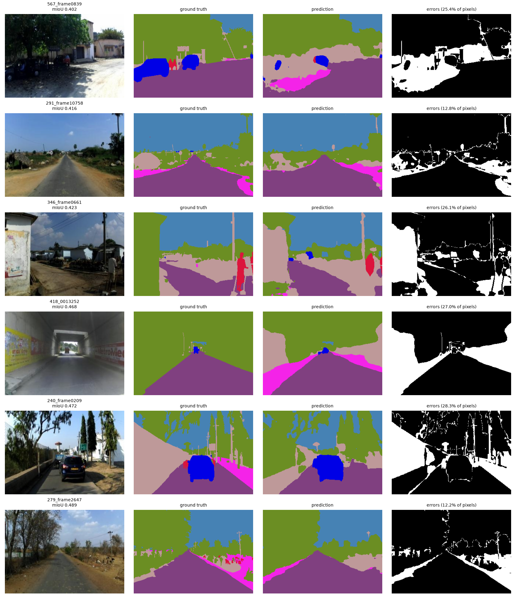

# Results

*Generated by `scripts/build_results.py` from the CSVs in `results/`. Do not edit by hand.*

**Task.** 7-class semantic segmentation of unstructured Indian road scenes, using IDD's
own level-1 label hierarchy: `drivable`, `non-drivable`, `living-thing`, `vehicles`,
`barrier-structures`, `construction-vegetation`, `sky`.

**Data.** IDD Lite (`idd20k_lite`) — 1607 labelled frames across 370 drive sequences,
at 320×227, trained at 320×224. Every dataset in this project comes from IDD; there are
no external data sources and no synthetic labels.

**Scale, stated plainly.** All results are at IDD Lite scale on a single M1 Pro (MPS).
This is a small dataset and the absolute mIoU values reflect that. The comparisons are
controlled — one factor varies at a time, with everything else held fixed — so the
*differences* between rows are meaningful even where the absolute numbers are modest.

Runs recorded: 1. Code version: `cebd279`.

---
## 1. Does a random split overstate generalization?

IDD groups frames into drive sequences — one folder per drive. Frames from the same
drive are seconds apart on the same road in the same light, so they are strongly
correlated. Splitting frames at random puts near-duplicates on both sides of the
train/val boundary.

Measured on this dataset, a random frame split puts **94.6% of validation frames in a
drive that also appears in training** (1607 frames across 370 drives). The three
datasets below differ *only* in how frames were assigned; the model, schedule,
augmentation and seed are identical.

| split | mIoU | mean acc | pixel acc | best epoch |
|---|---|---|---|---|
| IDD's own split (drive-disjoint) | 0.6913 | 0.7889 | 0.8867 | 27.0000 |

---

## 5. Confidence calibration

The serving layer returns a confidence score, so that score has to mean something.
Temperature is fitted on one half of the validation pixels and every number below is
computed on the other half, which the fit never saw.

| metric | before | after |
|---|---|---|
| Expected calibration error | 0.0211 | 0.0027 |
| Maximum calibration error | 0.1082 | 0.0508 |

Fitted temperature **T = 1.229** (overconfident before correction), reducing ECE by 87.0%.

Temperature scaling is monotone, so mIoU is provably unchanged — only the confidence
distribution moves.



---

## 6. Robustness under adverse conditions

Ten corruptions at severities 1/3/5, standing in for adverse driving conditions.
None of them appear in the training augmentation pipeline, so the drop measures
genuine distribution shift rather than a train/test augmentation mismatch.

Each corrupted set is also evaluated after **test-time BatchNorm adaptation** — the
running statistics are re-estimated on the shifted data using no labels and no
gradient steps. It isolates how much of the degradation is merely feature-statistic
drift rather than a genuine failure to perceive.

| corruption | sev | mIoU | + BN adapt | recovered | retention |
|---|---|---|---|---|---|
| fog | 1.0000 | 0.6854 | 0.6821 | -0.0033 | 0.9989 |
| fog | 3.0000 | 0.6744 | 0.6818 | 0.0073 | 0.9829 |
| rain | 1.0000 | 0.6007 | 0.6368 | 0.0362 | 0.8754 |
| rain | 3.0000 | 0.4652 | 0.5615 | 0.0964 | 0.6780 |
| low_light | 1.0000 | 0.6802 | 0.6756 | -0.0046 | 0.9913 |
| low_light | 3.0000 | 0.5609 | 0.6444 | 0.0836 | 0.8174 |
| motion_blur | 1.0000 | 0.6766 | 0.6777 | 0.0010 | 0.9861 |
| motion_blur | 3.0000 | 0.5896 | 0.6322 | 0.0426 | 0.8592 |
| gaussian_noise | 1.0000 | 0.6388 | 0.6615 | 0.0226 | 0.9310 |
| gaussian_noise | 3.0000 | 0.3410 | 0.6196 | 0.2786 | 0.4969 |

Clean baseline: **0.6862 mIoU**. Worst case: `gaussian_noise` at severity 3 → 0.3410.
 BatchNorm adaptation recovers **+0.0560 mIoU on average**, without labels or gradient updates.



---

## 7. Prediction stability

A deployed segmenter sees near-identical scenes repeatedly; one that flips classes
under imperceptible input changes is unusable at any mIoU. The natural measurement is
frame-to-frame flicker on video — **which IDD Lite cannot support**: frames within a
drive are not adjacent (median gap ~4,400 frame indices, only 0.5% within 30 frames),
so a flicker number computed from them would really be measuring scene change.

Instead, each image is perturbed by a small label-preserving transform and the
prediction compared against the unperturbed one. Geometric shifts are inverted before
comparison, so only genuine class flips are counted. No ground truth is required.

| perturbation | flip rate | flip rate (conf ≥ 0.8) | Δ confidence |
|---|---|---|---|
| shift_1px | 0.0206 | 0.0002 | 0.0157 |
| shift_2px | 0.0322 | 0.0009 | 0.0241 |
| brightness_5pct | 0.0042 | 0.0000 | 0.0036 |
| brightness_-5pct | 0.0039 | 0.0000 | 0.0033 |
| noise_sigma0.01 | 0.0132 | 0.0004 | 0.0105 |
| jpeg_q90 | 0.0077 | 0.0000 | 0.0061 |

---

## 9. Error analysis

Validation mIoU 0.6857. Per-image mIoU percentiles: p5=0.496, p25=0.576, p50=0.617, p75=0.674, p95=0.736

Strongest confusions (share of a true class's pixels given to another):

| true class | predicted as | rate |
|---|---|---|
| barrier-structures | construction-vegetation | 26.7% |
| non-drivable | drivable | 20.3% |
| living-thing | vehicles | 19.9% |
| non-drivable | barrier-structures | 16.0% |
| living-thing | barrier-structures | 9.4% |
| non-drivable | construction-vegetation | 8.5% |





The hardest validation frames, shown as image / ground truth / prediction / error map:



---

## Reproducing

```bash
python -m data.prepare_masks --split-mode all   # build dataset variants
./scripts/reproduce.sh                          # every table above
```
